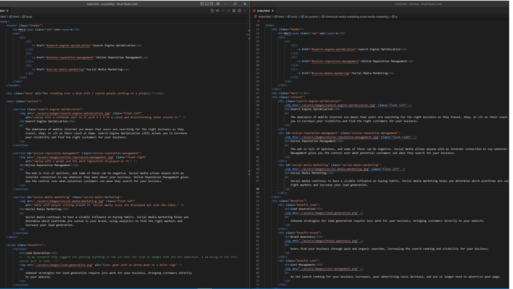

# Accessibility Standards 

## Overview 

This project was designed to help with accessibility and ensure that people with disabilities would be able to access the webpage with out any issues.

### UserStore

AS A marketing agency
I WANT a codebase that follows accessibility standards
SO THAT our own site is optimized for search engines

### Acceptance Criteria

- GIVEN a webpage meets accessibility standards
- WHEN I view the source code
  THEN I find semantic HTML elements
- WHEN I view the structure of the HTML elements
  THEN I find that the elements follow a logical structure independent of styling and positioning
- WHEN I view the image elements
  THEN I find accessible alt attributes
- WHEN I view the heading attributes
  THEN they fall in sequential order
- WHEN I view the title element
  THEN I find a concise, descriptive title

## Technologies
 
- **HTML**
- **CSS**

## Screenshots
### Before and After photo

The fixed code is the first image in the photo.

## Credits

N/A

## License

Please refer to the LICENSE in the repo. # Accessibility Standards 

## Links

### GitHub Repository

### live Link
 https://kvance1010.github.io/accessibility/
